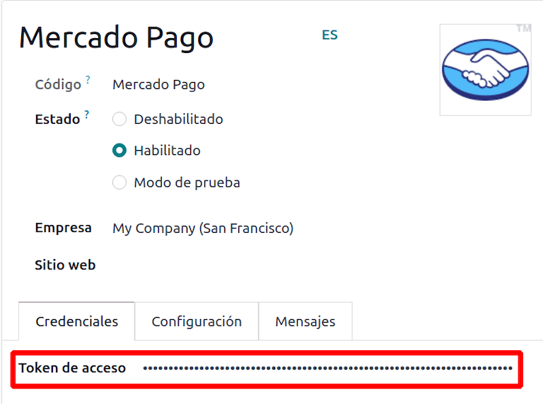

============
Mercado Pago
============

`Mercado Pago <https://www.mercadopago.com/>`_ is an online payment provider covering several
countries, currencies and payment methods in Latin America.

.. warning::
   The `Mercado Pago Checkout Pro
   <https://www.mercadopago.com.ar/developers/en/docs/checkout-pro/landing/>`_ payment processing
   method does not support payments through the *Subscriptions* and *Point of Sale* applications.

.. _payment_providers/mercado_pago/configure_dashboard:

Configuration on Mercado Pago Dashboard
=======================================

#. Log into the `Mercado Pago Dashboard <https://www.mercadopago.com.mx/developers/panel>`_
   and select your application or create a new one.
#. Select :guilabel:`Credenciales de producción` in the left part of the application page, then
   select the industry, optionally enter your domain, and click :guilabel:`Activar credenciales
   de producción`.
#. Copy the :guilabel:`Access token` and save it for later.

.. tip::
   If you are trying Mercado Pago as a test, select :guilabel:`Credienciales de prueba` in the left
   part of the application page, then copy the test :guilabel:`Access token`.

.. image:: mercado_pago/mp-credentials.png
   :align: center
   :alt: Production and testing credentials in Mercado Pago.

.. _payment_providers/mercado_pago/configure_odoo:

Configuration on Odoo
=====================

#. :ref:`Navigate to the payment provider Mercado Pago <payment_providers/add_new>` and change its
   state to :guilabel:`Enabled`.
#. In the :guilabel:`Credentials` tab, fill in the :guilabel:`Access Token` with the value you saved
   at the step :ref:`payment_providers/mercado_pago/configure_dashboard`.
#. Configure the rest of the options to your liking.

.. important::
   Mercado Pago functions correctly with the :guilabel:`Enabled` status activated for production and
   testing purposes. For this payment provider the *Test Mode* configuration in Odoo will result in
   an error message.

.. seealso::
   :doc:`../payment_providers`
