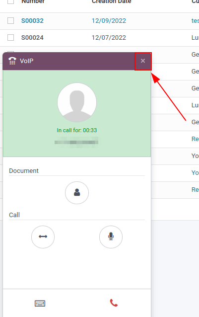
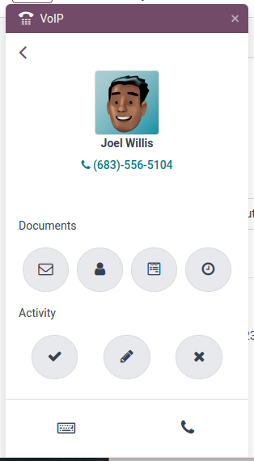

===========
VoIP Widget
===========

Phone calls
===========

Make phone calls by clicking on the phone icon in the top navigation bar. A widget will appear in
the lower left corner of the Odoo dashboard. Freely navigate throughout the database while making
and receiving calls from the widget.

When receiving call in Odoo, the :abbr:`VoIP (Voice over Internet Protocol)` widget rings and
displays a notification. To minimize the widget click the `X` icon in the upper right of the
screen.

.. note::
   The :abbr:`VoIP (Voice over Internet Protocol)` number is the one provided by Axivox. It can be
   accessed by navigating to `https://manage.axivox.com/ <https://manage.axivox.com/>`_. After
   logging into the portal go to :menuselection:`Users --> Outgoing number` (column).

Troubleshooting
===============

.. tip::
   If a *Missing Parameter* message appears in the **Odoo softphone**, refresh the Odoo window and
   try again.

   .. image:: voip_widget/missing-parameter.png
      :align: center
      :alt: "Missing Parameter" error message in the Odoo softphone.

.. tip::
   If an *Incorrect Number* message appears in the Odoo softphone, make sure to use the
   international format, leading with the plus (+) sign followed by the international country code.
   E.g., +16506913277 (where +1 is the international prefix for the United States).

   .. image:: voip_widget/incorrect-number.png
      :align: center
      :alt: "Incorrect Number" error message in the Odoo softphone.

Tabs
====

Recent
------

Under the :guilabel:`Recent` tab of the :abbr:`VoIP (Voice over Internet Protocol)` widget, one can
see all the call history for the user. This includes incoming and outgoing calls. Any number can be
clicked into to call back.

Next activities
---------------

Under the :guilabel:`Next Activities` a user can see any activities assigned to them that a due to
complete for the day. Click in the activity to perform any actions including: Sending an email,
accessing their contact, scheduling another activity or accessing a linked record (such as a Sales
Order, Lead/Opportunity or Project Task). The user can also mark the activity as complete, edit it,
or cancel it out.

The customer can be called simply by pressing the [ 📞 ] phone icon, or clicking on the keypad icon
to dial another number for the customer.

Contacts
--------

Under the :guilabel:`Contacts` tab, a user can access an contact in the *Contacts* app. Any contact
can be easily called by clicking into the contact. A search feature is also available in the upper
right-side of the widget, represented by a [ 🔎 ] magnifying glass icon.
